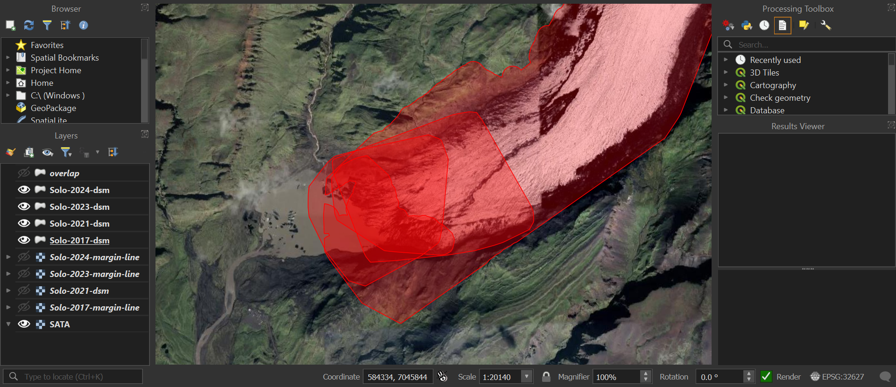
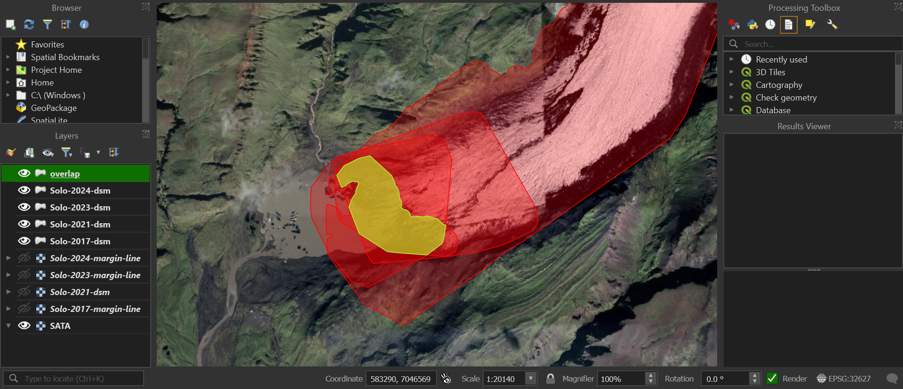

# KML-Outline-and-Overlap-of-DEMs
These scripts work together to generate KML outlines of DEM files and then use Shapely polygons generated alongside the KMLs to generate an overlap KML of all the DEMs.

## DSM KML Outlines

## Overlap KML Separated

## DSM KMLs with Overlap KML

